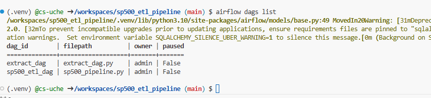
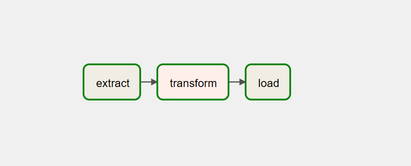
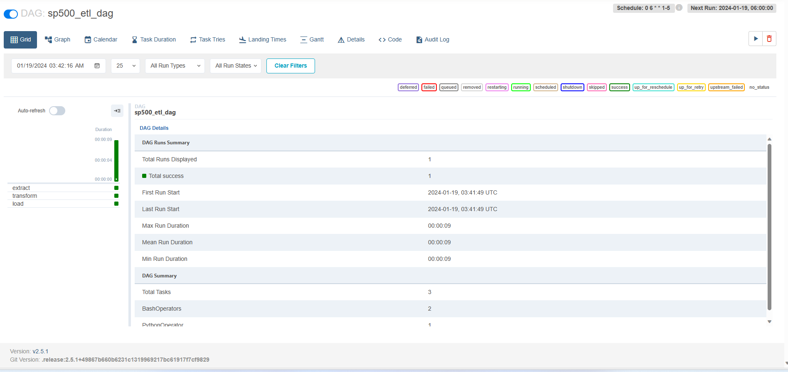

# SP-500 Pipeline

### Overview
Unlock the power of automated data processing with our S&P 500 Pipeline. This project demonstrates a streamlined approach to generate, transform, and store financial data using Airflow, a robust workflow automation tool. Whether you're a financial analyst, data scientist, or business professional, our solution offers efficiency, reliability, and ease of use.

### Key Features
* Task Decoupling: Gain unparalleled visibility into the workflow with decoupled tasks, enabling a detailed analysis of potential issues.

* Task Retry: Enjoy the flexibility to retry tasks in case of failures, ensuring the pipeline's resilience and accuracy.

* Automation: Schedule the pipeline to run during non-peak hours, automating the entire process for daily updates on S&P 500 companies.

* Batch Streaming: Leverage Airflow's capabilities for efficient batch streaming, providing real-time insights into financial data.

## Business Challenge
Imagine a scenario where a financial analyst needs daily insights into S&P 500 companies' sectors for comprehensive financial analysis. The S&P 500 data is updated on a daily bases as new stocks enter and exit the listing. Our pipeline addresses this challenge, ensuring accurate and up-to-date information is readily available.

### How It Works
1. Extract: Gather data on S&P 500 companies.

2. Transform: Aggregate the number of companies in each sector.

3. Load: Store the transformed data in an SQLite database, providing a structured repository for analysis.

4. Automation: Set the pipeline to run daily (Monday to Friday) for automated, up-to-date insights.

### Benefits
* Efficiency: Save time with automated workflows, allowing you to focus on critical analysis rather than manual data processing.

* Reliability: Rely on Airflow's proven capabilities for workflow management, ensuring consistent and accurate results.

* Customization: Tailor the pipeline to your specific analysis needs, ensuring flexibility and adaptability.

### Setup
* Run the `install` bash script using source to export necessary variables.
* Create the SQLite database and table

## Demo
Explore the user-friendly interface with Airflow's intuitive features:
* List of Dags: Get an overview of all your Directed Acyclic Graphs (DAGs) programmatically.

* Graph View: Visualize the workflow with a comprehensive graph view for easy navigation.

* Grid View: Dive into the details with a grid view, providing a structured overview of your data processing tasks.
